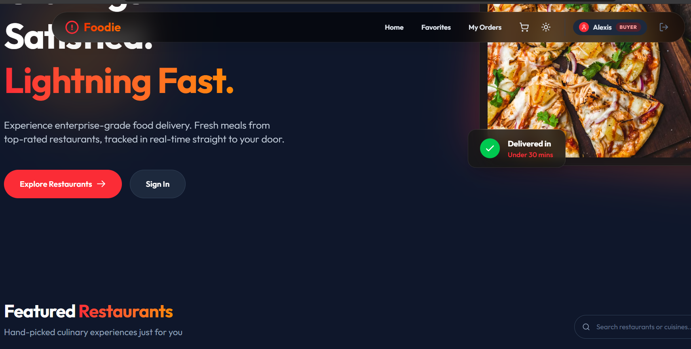
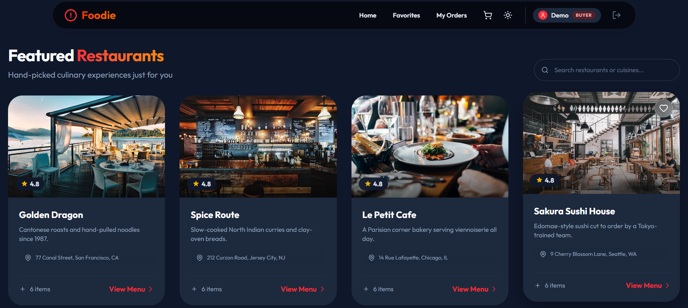
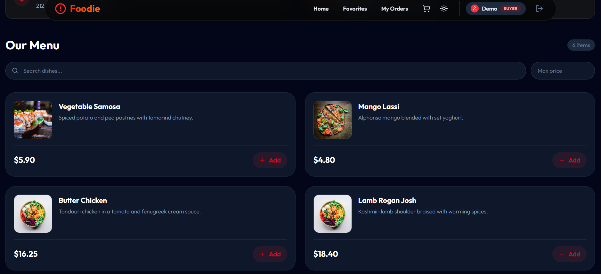
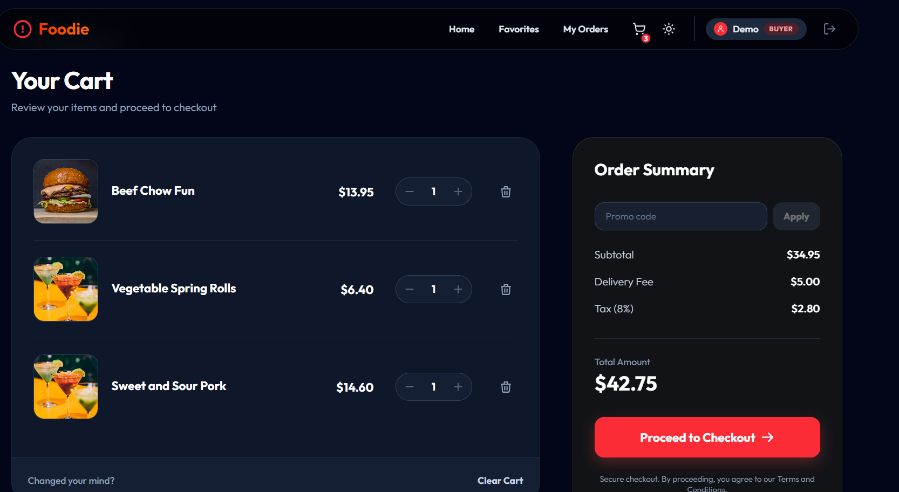
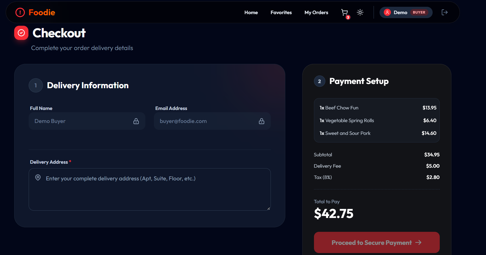
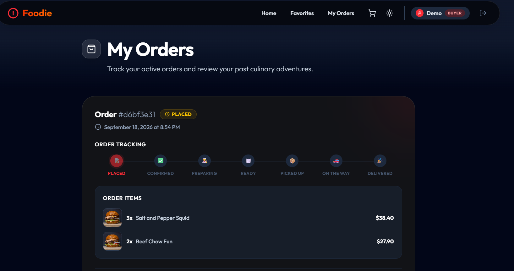
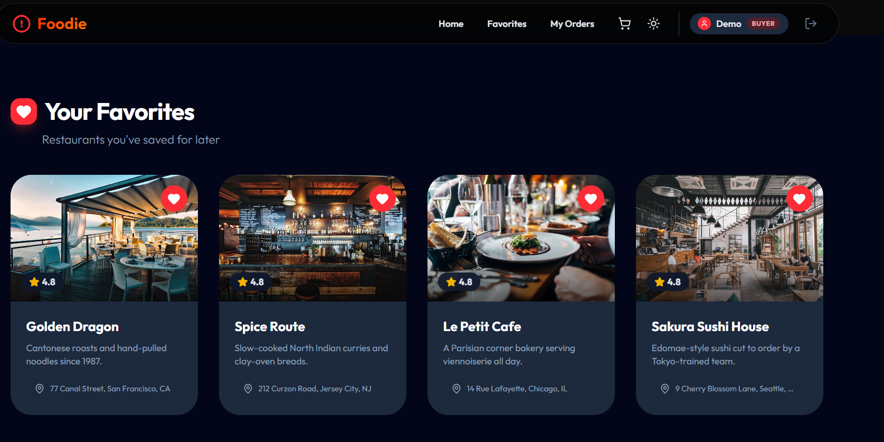
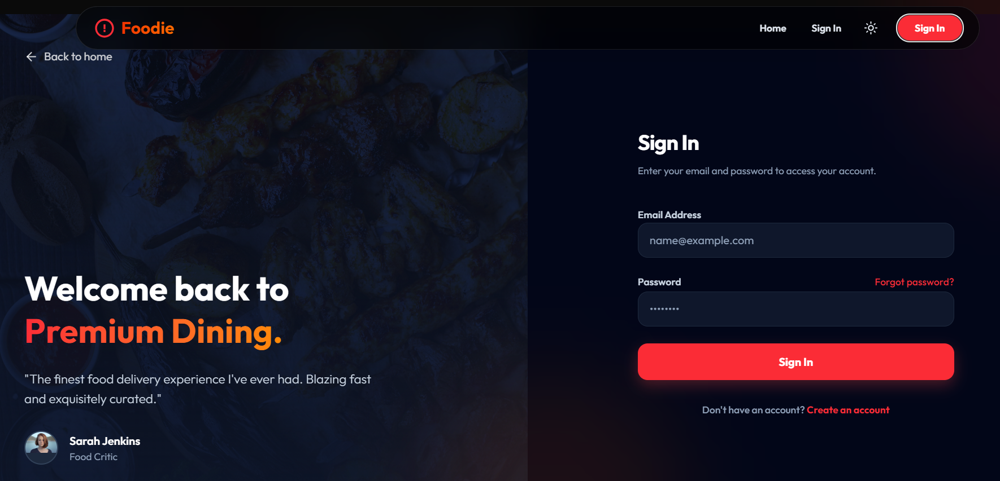

# QuickServe — Food Delivery Platform

A production-deployed, full-stack food ordering platform built with **.NET 8** and **React 19**.
Four distinct user roles — buyer, seller, delivery rider and admin — each with their own
dashboard, permissions and workflows.

**[Live Demo](https://quick-serve-food-order-app.vercel.app)** ·
**[API](https://foodorder-api-690fd7.azurewebsites.net/restaurants)** ·
Sign in with `buyer@foodie.com` / `password123`



---

## Screenshots

### Restaurant discovery
Searchable restaurant grid with ratings, cuisine descriptions and one-click favouriting.



### Menu browsing
Per-restaurant menu with dish search and a maximum-price filter.



### Cart
Live quantity controls with an order summary calculating subtotal, delivery fee and 8% tax.



### Checkout
Two-step checkout capturing delivery details alongside an itemised payment summary.



### Order tracking
Seven-stage delivery timeline from *Placed* through to *Delivered*.



### Favourites and sign-in





---

## Features

### Authentication and authorisation
- JWT-based registration and login
- Four roles — Buyer, Seller, DeliveryBoy, Admin
- Authorisation enforced on both sides: `ProtectedRoute` guards on the client, `[Authorize(Roles = ...)]` on API endpoints
- Role-aware navigation that shows each user only the pages they can access

### Buyer
- Browse and search 12 restaurants, each with photography and ratings
- Per-restaurant menu with dish search and price filtering
- Cart with add, quantity update, remove and clear, persisted server-side
- Order summary with delivery fee and tax calculation
- Checkout capturing delivery information
- Order history with a seven-stage tracking timeline
- Favourite restaurants
- Profile with multiple saved addresses (Home, Work), one marked default
- Star ratings and written reviews per restaurant

### Seller
- Dashboard with revenue, pending order count and restaurant totals
- Full create, edit and delete for owned restaurants
- Full create, edit and delete for menu items within each restaurant
- Incoming order queue with status progression

### Delivery rider
- Queue of assigned deliveries
- Pool of unassigned orders ready for pickup
- Status updates through pickup, in-transit and delivered

### Admin
- Platform dashboard covering users, orders, revenue and restaurants
- User directory with role labels and avatars
- Full order listing across every restaurant
- Full restaurant listing

### Interface
- Dark and light themes with a navigation toggle
- Responsive layouts from mobile to desktop
- Skeleton loaders during fetches and toast notifications for actions
- Custom 404 page

### Known limitations
Kept deliberately visible rather than hidden:
- **Payments are not implemented.** `PaymentsController` returns a stubbed intent, and the
  client calls a checkout-session endpoint that does not exist server-side, so the final
  payment step fails. Everything up to it works.
- **Passwords are stored and compared in plain text.** Acceptable for seeded demo data,
  but hashing is required before any real use.
- **No automated test suite yet** — see [Testing](#testing).

---

## Tech stack

### Frontend
| Technology | Purpose |
|---|---|
| React 19 + TypeScript | UI with strict typing |
| Vite 7 | Build tool and dev server |
| Tailwind CSS 4 | Styling and dark mode |
| React Router 7 | Client-side routing |
| Zustand | State for auth, cart, favourites, theme, toasts |
| Radix UI + Lucide | Accessible primitives and icons |

### Backend
| Technology | Purpose |
|---|---|
| .NET 8 Web API | HTTP layer |
| Clean Architecture | API / Application / Domain / Infrastructure separation |
| MediatR | CQRS command and query handlers |
| Entity Framework Core 8 | Data access and migrations |
| FluentValidation | Request validation |
| ErrorOr | Typed result handling without exceptions |
| JWT Bearer | Stateless authentication |
| Bogus | Seed data generation |

### Infrastructure
| Technology | Purpose |
|---|---|
| Azure App Service (Linux) | API hosting |
| Azure SQL Database (serverless) | Relational storage with auto-pause |
| Vercel | Frontend hosting and CDN |
| GitHub Actions | CI/CD with OIDC federated authentication |

---

## Folder structure

```
FoodOrderApplication/
├── api/
│   ├── FoodOrder.API/                 HTTP layer
│   │   ├── Controllers/               auth, restaurants, orders, cart, users,
│   │   │                              addresses, favorites, reviews, payments
│   │   ├── Common/                    error handling, mapping
│   │   └── Program.cs                 startup, CORS, migrations, seeding
│   │
│   ├── FoodOrder.Application/         business logic (CQRS)
│   │   ├── Authentication/            register and login handlers
│   │   ├── Restaurants/               restaurant and menu commands/queries
│   │   ├── Orders/                    order lifecycle handlers
│   │   ├── Carts/                     cart operations
│   │   ├── Users/ Addresses/ Favorites/ Reviews/
│   │   ├── Common/                    interfaces, behaviours, errors
│   │   └── Contracts/                 request and response records
│   │
│   ├── FoodOrder.Domain/              enterprise core
│   │   ├── Entities/                  User, Restaurant, MenuItem, Order,
│   │   │                              OrderItem, Cart, CartItem, Review,
│   │   │                              Address, Favorite
│   │   └── Common/                    UserRole, OrderStatus, StockImages
│   │
│   └── FoodOrder.Infrastructure/      external concerns
│       ├── Persistence/               DbContext, repositories, DataSeeder
│       ├── Authentication/            JWT generation
│       └── Migrations/                EF Core migration history
│
├── client/
│   └── src/
│       ├── features/                  vertical slices, each with pages +
│       │                              services: auth, cart, orders, myOrders,
│       │                              favorites, users, restaurant, reviews,
│       │                              payment
│       ├── pages/                     route-level pages
│       │   ├── admin/                 dashboard, users, orders, restaurants
│       │   ├── seller/                dashboard, restaurants, menu items, orders
│       │   └── delivery/              assigned deliveries
│       ├── components/                Navbar, Footer, ProtectedRoute, UI kit
│       ├── store/                     Zustand stores
│       ├── routes/AppRoutes.tsx       route table
│       └── lib/api.ts                 typed fetch wrapper
│
└── .github/workflows/                 CI/CD pipelines
```

---

## Testing

The project is verified through compile-time and pipeline gates rather than an automated
suite. Stating this plainly, because it is the most obvious area for future work.

**What runs on every push**
| Gate | Scope |
|---|---|
| `tsc -b` | Strict TypeScript compilation across the client |
| `vite build` | Production bundle must build successfully |
| ESLint | Static analysis (currently report-only, see below) |
| `dotnet build` | Full solution build, warnings surfaced |

A failing type-check or build blocks deployment, so no broken bundle reaches production.

**Manual verification performed**
- Every API endpoint exercised against the deployed environment with authenticated requests
  for all four roles
- Database integrity confirmed by direct SQL inspection — row counts per table and referential
  checks after each seed
- All image URLs verified to return HTTP 200, so no broken media renders
- Every client route cross-checked against the router to confirm no dead links

**Planned**
- xUnit unit tests for Application-layer handlers, which are pure and already isolated behind
  interfaces, making them the natural starting point
- Integration tests using `WebApplicationFactory` against a containerised SQL Server
- Vitest and React Testing Library for component coverage
- Promoting ESLint from report-only to blocking once its 55 pre-existing warnings are cleared

---

## CI/CD pipeline

Two GitHub Actions workflows plus Vercel's Git integration. Every push to `main` reaches
production without manual steps.

### Backend — `.github/workflows/backend-deploy.yml`

Triggered by pushes touching `api/**`, and manually via `workflow_dispatch`.

```
build job                          deploy job (main only)
├── checkout                       ├── download artifact
├── setup .NET 8                   ├── azure/login  (OIDC)
├── dotnet restore                 ├── zip package
├── dotnet build (Release)         └── az webapp deploy
├── dotnet publish
└── upload artifact
```

**Authentication uses OIDC federated credentials — no passwords or publish profiles are stored
anywhere.** GitHub presents a short-lived token that Azure exchanges for access, scoped by a
federated credential that only trusts this repository's `main` branch. The service principal
holds the Website Contributor role on a single resource group.

Pull requests build and publish but never deploy, so a broken branch cannot reach production.

Required repository variables:

| Variable | Purpose |
|---|---|
| `AZURE_WEBAPP_NAME` | Target App Service |
| `AZURE_CLIENT_ID` | Federated identity application |
| `AZURE_TENANT_ID` | Azure AD tenant |
| `AZURE_SUBSCRIPTION_ID` | Target subscription |

### Frontend — `.github/workflows/frontend-ci.yml` + Vercel

The workflow installs with `npm ci`, lints, and runs a production build on every push and
pull request touching `client/**`.

Deployment itself is handled by Vercel's Git integration: production builds on `main`, and
every pull request receives its own preview URL. `VITE_API_URL` is injected at build time
from Vercel project settings.

### Database migrations

EF Core migrations apply automatically at application startup, so a schema change ships with
the same deployment as the code depending on it — no manual migration step.

---

## Demo accounts

All accounts use the password `password123`.

| Role | Email | What the account demonstrates |
|---|---|---|
| **Admin** | `admin@foodie.com` | Platform dashboard, 40 users, 76 orders, 12 restaurants |
| **Seller** | `seller@foodie.com` | 4 owned restaurants, 24 dishes, 35 orders |
| **Buyer** | `buyer@foodie.com` | 8 orders spanning every status, 4 favourites, 2 addresses, active cart |
| **Delivery** | `delivery@foodie.com` | 12 assigned deliveries plus an available pickup queue |

The database is seeded with 12 restaurants, 72 dishes, 40 users, 76 orders, 151 order items,
57 reviews, 50 addresses and 36 favourites — every table populated, every record with imagery.

---

## Running locally

**Prerequisites:** .NET 8 SDK, Node.js 20+, SQL Server (LocalDB or Express)

```bash
# API — http://localhost:5182, Swagger at /swagger
cd api
dotnet restore FoodOrder.sln
dotnet run --project FoodOrder.API

# Client — http://localhost:5173
cd client
npm install
npm run dev
```

Point the API at your local SQL Server via `DefaultConnection` in
`api/FoodOrder.API/appsettings.json`. Migrations and seed data apply automatically on first
run. Create `client/.env` with `VITE_API_URL=http://localhost:5182` — it is git-ignored so it
cannot override deployed configuration.

---

## Deployment

| Component | Platform | URL |
|---|---|---|
| **Frontend** | Vercel | https://quick-serve-food-order-app.vercel.app |
| **API** | Azure App Service (Linux, South Central India) | https://foodorder-api-690fd7.azurewebsites.net |
| **Database** | Azure SQL Database (GP serverless, auto-pause) | `sql-foodorder-690fd7.database.windows.net` |
| **Source** | GitHub | https://github.com/sachinthacham/QuickServe-FoodOrderApp |

Sample endpoint returning live seeded data:
[`/restaurants`](https://foodorder-api-690fd7.azurewebsites.net/restaurants)

### Architecture

```
Browser ──► Vercel CDN (React SPA)
                  │  HTTPS + JWT
                  ▼
         Azure App Service (.NET 8 API)
                  │  encrypted connection
                  ▼
         Azure SQL Database (serverless)
```

### Cost-optimised hosting

Deliberately configured to run at roughly **$0.30/month** so the demo can stay online
indefinitely on student credit:

| Resource | Configuration | Cost |
|---|---|---|
| App Service | F1 Free tier | $0 |
| Azure SQL | Serverless, auto-pauses after 60 minutes idle | ~$0 idle |
| SQL storage | 2 GB provisioned | ~$0.26/mo |
| Vercel | Hobby tier | $0 |

**Trade-off:** both tiers sleep when idle, so the first request after a quiet period takes
about 18 seconds while the app and database wake. Subsequent requests return in under a
second.

**Before showing the site to anyone,** open
[`/restaurants`](https://foodorder-api-690fd7.azurewebsites.net/restaurants) and wait for the
JSON to appear. That wakes both services, and they stay warm for the session.
